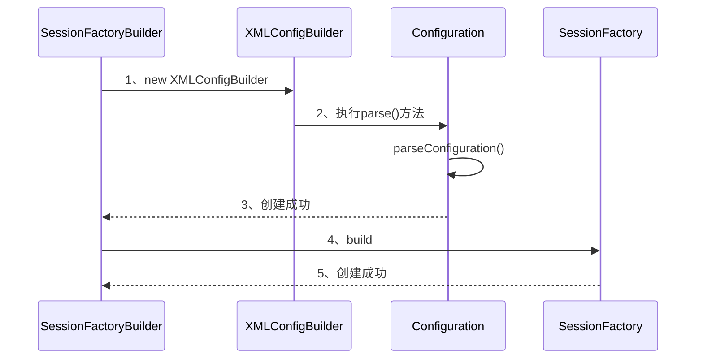

# 解析Mapper文件

>   这里指的是mapper.xml

再来回顾一下解析Mapper的代码：

```java
private void mapperElement(XNode parent) throws Exception {
    if (parent != null) {
        for (XNode child : parent.getChildren()) {
            // 包扫描Mapper接口
            if ("package".equals(child.getName())) {
                String mapperPackage = child.getStringAttribute("name");
                configuration.addMappers(mapperPackage);
            } else {
                String resource = child.getStringAttribute("resource");
                String url = child.getStringAttribute("url");
                String mapperClass = child.getStringAttribute("class");
                // 处理resource加载的mapper.xml
                if (resource != null && url == null && mapperClass == null) {
                    ErrorContext.instance().resource(resource);
                    InputStream inputStream = Resources.getResourceAsStream(resource);
                  	//注意，这里创建了XMLMapperBuilder用来解析mapper.xml
                    XMLMapperBuilder mapperParser = new XMLMapperBuilder(inputStream, configuration, resource, configuration.getSqlFragments());
                    mapperParser.parse();
                } else if (resource == null && url != null && mapperClass == null) {
                    // 处理url加载的mapper.xml
                    ErrorContext.instance().resource(url);
                    InputStream inputStream = Resources.getUrlAsStream(url);
                    XMLMapperBuilder mapperParser = new XMLMapperBuilder(inputStream, configuration, url, configuration.getSqlFragments());
                    mapperParser.parse();
                } else if (resource == null && url == null && mapperClass != null) {
                    // 注册单个Mapper接口
                    Class<?> mapperInterface = Resources.classForName(mapperClass);
                    configuration.addMapper(mapperInterface);
                } else {
                    throw new BuilderException("A mapper element may only specify a url, resource or class, but not more than one.");
                }
            }
        }
    }
}
```

首先要注意，这里的parent指的是配置文件中`<mappers>`的标签，而每个child才是指子标签`<mapper>`

可以看到，需要解析mapper.xml文件，首先会创建XMLMapperBuilder

## XMLMapperBuilder

```java
public class XMLMapperBuilder extends BaseBuilder {
  private final XPathParser parser;
  private final MapperBuilderAssistant builderAssistant;
  private final Map<String, XNode> sqlFragments;
  private final String resource;
	//省略...
}
```

*   XPathParser：前面已经说过了，是用来解析xml文件的
*   MapperBuilderAssistant：**这个是重点**，可以说接下来的工作都是交给这个“助手“来完成的
*   sqlFragments：就是用来存放公共的`<sql>`标签的节点
*   resource：mapper.xml文件的路径（即`<mapper>`标签中的resource属性）

>   其实这里我也有个疑问，为什么这个方法需要传configuration.getSqlFragments()，它前一个参数传configuration不就可以获取吗？

再来看看调用它的构造方法

```java
private XMLMapperBuilder(XPathParser parser, Configuration configuration, String resource, Map<String, XNode> sqlFragments) {
    super(configuration);
    this.builderAssistant = new MapperBuilderAssistant(configuration, resource);
    this.parser = parser;
    this.sqlFragments = sqlFragments;
    this.resource = resource;
}
```

看来主要就是需要新建这个“助手”了

### parse()

新建完后，就是调用它的parse()方法来解析每个mapper节点

```java
public void parse() {
    // 如果当前xml资源还没有被加载过
    if (!configuration.isResourceLoaded(resource)) {
        // 2. 解析mapper元素
        configurationElement(parser.evalNode("/mapper"));
      	// 表示该mapper已经被加载
        configuration.addLoadedResource(resource);
        // 3. 解析和绑定命名空间
        bindMapperForNamespace();
    }
    // 4. 解析resultMap
    parsePendingResultMaps();
    // 5. 解析cache-ref
    parsePendingCacheRefs();
    // 6. 解析声明的statement
    parsePendingStatements();
}
```

明显，configurationElement(parser.evalNode("/mapper"))这个方法才是解析mapper节点的核心，接下来进去看看

### configurationElement(XNode context)

```java
private void configurationElement(XNode context) {
    try {
        // 提取mapper.xml对应的命名空间
        String namespace = context.getStringAttribute("namespace");
        if (namespace == null || namespace.isEmpty()) {
            throw new BuilderException("Mapper's namespace cannot be empty");
        }
        builderAssistant.setCurrentNamespace(namespace);
        // 解析cache、cache-ref
        cacheRefElement(context.evalNode("cache-ref"));
        cacheElement(context.evalNode("cache"));
        // 解析提取parameterMap(官方文档称已废弃，不看了)
        parameterMapElement(context.evalNodes("/mapper/parameterMap"));
        // 解析提取resultMap
        resultMapElements(context.evalNodes("/mapper/resultMap"));
        // 解析封装SQL片段
        sqlElement(context.evalNodes("/mapper/sql"));
        // 构造Statement
        buildStatementFromContext(context.evalNodes("select|insert|update|delete"));
    } catch (Exception e) {
        throw new BuilderException("Error parsing Mapper XML. The XML location is '" + resource + "'. Cause: " + e, e);
    }
}
```

这里首先可以看到，它会提取mapper.xml的namespace命名空间（就是我们平常写映射文件时，对应的Mapper接口的路径），并且保证这个命名空间不能为空，即唯一标识

之后会解析是否有引用其它的二级缓存（这个等到后续缓存篇再去看）

然后就到了**重点内容**，即解析每个`<resultMap>`标签

再然后是`<sql>`标签

最后才是**重中之重**，解析sql语句

## 解析ResultMap

```java
private void resultMapElements(List<XNode> list) {
    for (XNode resultMapNode : list) {
        try {
            resultMapElement(resultMapNode);
        } catch (IncompleteElementException e) {
            // ignore, it will be retried
        }
    }
}
```

显然，我们的mapper.xml文件中可以定义多个`<resultMap>`标签

接下来当然进入到resultMapElement(XNode resultMapNode)中去看（高能预警！！！）

```java
private ResultMap resultMapElement(XNode resultMapNode) {
    return resultMapElement(resultMapNode, Collections.emptyList(), null);
}

private ResultMap resultMapElement(XNode resultMapNode, List<ResultMapping> additionalResultMappings, Class<?> enclosingType) {
    // 解析resultMap映射的目标结果集实体类型
    String type = resultMapNode.getStringAttribute("type",
                         resultMapNode.getStringAttribute("ofType", 
                         resultMapNode.getStringAttribute("resultType", 
                         resultMapNode.getStringAttribute("javaType"))));
    // 加载目标结果集实体类型
    Class<?> typeClass = resolveClass(type);
    if (typeClass == null) {
        typeClass = inheritEnclosingType(resultMapNode, enclosingType);
    }
    Discriminator discriminator = null;
   
    List<ResultMapping> resultMappings = new ArrayList<>(additionalResultMappings);
    List<XNode> resultChildren = resultMapNode.getChildren();
    // 解析resultMap的子标签，并封装为resultMapping
    for (XNode resultChild : resultChildren) {
        if ("constructor".equals(resultChild.getName())) {
            processConstructorElement(resultChild, typeClass, resultMappings);
        } else if ("discriminator".equals(resultChild.getName())) {
            discriminator = processDiscriminatorElement(resultChild, typeClass, resultMappings);
        } else {
            List<ResultFlag> flags = new ArrayList<>();
            if ("id".equals(resultChild.getName())) {
                flags.add(ResultFlag.ID);
            }
            resultMappings.add(buildResultMappingFromContext(resultChild, typeClass, flags));
        }
    }
    
    // 获取resultMap的id、继承的resultMap id、autoMapping
    String id = resultMapNode.getStringAttribute("id", resultMapNode.getValueBasedIdentifier());
    String extend = resultMapNode.getStringAttribute("extends");
    Boolean autoMapping = resultMapNode.getBooleanAttribute("autoMapping");
    // 利用ResultMapResolver处理resultMap
    ResultMapResolver resultMapResolver = new ResultMapResolver(builderAssistant, id, 
            typeClass, extend, discriminator, resultMappings, autoMapping);
    try {
        return resultMapResolver.resolve();
    } catch (IncompleteElementException e) {
        // 解析失败，说明resultMap标签的信息不完整，记录在全局Configuration中，并抛出异常
        configuration.addIncompleteResultMap(resultMapResolver);
        throw e;
    }
}
```

这里的代码当然很复杂，那就逐一拆开来看

### 1、解析目标实体类型

```java
//...
String type = resultMapNode.getStringAttribute("type",
                     resultMapNode.getStringAttribute("ofType", 
                     resultMapNode.getStringAttribute("resultType", 
                     resultMapNode.getStringAttribute("javaType"))));
//解析获取到的类型
Class<?> typeClass = resolveClass(type);
if (typeClass == null) {
    typeClass = inheritEnclosingType(resultMapNode, enclosingType);
}
//...
```

这个目标类型指的是什么呢？其实就是我们的`<resultMap>`标签中指定要返回的实体类型

那为什么这个方法这么复杂，又有`type、ofType、resultType、javaType`呢，其实先来看看这个方法：

```java
public String getStringAttribute(String name, String def) {
  String value = attributes.getProperty(name);
  if (value == null) {
    return def;
  } else {
    return value;
  }
}
```

答案很明显了，其实就是给多一个默认值；因此这个方法的意思就是，会按照`type、ofType、resultType、javaType`的顺序来获取返回的类型，如果获取不到则会抛出异常

### 2、解析子标签

```java
//...
Discriminator discriminator = null;
List<ResultMapping> resultMappings = new ArrayList<>(additionalResultMappings);
List<XNode> resultChildren = resultMapNode.getChildren();
// 解析resultMap的子标签，并封装为resultMapping
for (XNode resultChild : resultChildren) {
    if ("constructor".equals(resultChild.getName())) {
        processConstructorElement(resultChild, typeClass, resultMappings);
    } else if ("discriminator".equals(resultChild.getName())) {
        discriminator = processDiscriminatorElement(resultChild, typeClass, resultMappings);
    } else {
        List<ResultFlag> flags = new ArrayList<>();
        if ("id".equals(resultChild.getName())) {
            flags.add(ResultFlag.ID);
        }
        resultMappings.add(buildResultMappingFromContext(resultChild, typeClass, flags));
    }
}
//...
```

要看懂这里，首先要明白，`<resultMap>`分为三类子标签

*   `<constructor>`：用来定义实体类的构造器，由于我们一般用空参构造器，因此很少使用
*   `<discriminator>`：用来做逻辑判断，同样很少使用
*   普通标签：常用
    *   `<id>`：用来定义主键
    *   `<result>`：用来配置字段映射
    *   `<association>`：用来配置类中的类，比如User中关联一个Department
    *   `<collection>`：用来处理一对多，比如User中关联一个集合

最终，它们要封装成一个ResultMapping的对象（当然这个过程很复杂，后续再展开）

```java
public class ResultMapping {

  private Configuration configuration;
  private String property;
  private String column;
  private Class<?> javaType;
  private JdbcType jdbcType;
  private TypeHandler<?> typeHandler;
  private String nestedResultMapId;
  private String nestedQueryId;
  private Set<String> notNullColumns;
  private String columnPrefix;
  private List<ResultFlag> flags;
  private List<ResultMapping> composites;
  private String resultSet;
  private String foreignColumn;
  private boolean lazy;
//...
}
```

### 3、构建ResultMap

```java
//...
// 获取resultMap的id、继承的resultMap id、autoMapping
String id = resultMapNode.getStringAttribute("id", resultMapNode.getValueBasedIdentifier());
String extend = resultMapNode.getStringAttribute("extends");
Boolean autoMapping = resultMapNode.getBooleanAttribute("autoMapping");
// 利用ResultMapResolver处理resultMap
ResultMapResolver resultMapResolver = new ResultMapResolver(builderAssistant, id, 
        typeClass, extend, discriminator, resultMappings, autoMapping);
try {
    return resultMapResolver.resolve();
} catch (IncompleteElementException e) {
    // 解析失败，说明resultMap标签的信息不完整，记录在全局Configuration中，并抛出异常
    configuration.addIncompleteResultMap(resultMapResolver);
    throw e;
}
//...
```

先来说下两个属性：

*   extends：表示继承，`<resultMap>`标签是可以继承的
*   autoMapping：表示是否要开启自动映射

之后又会构造一个ResultMapResolver对象，最终生成一个ResultMap对象（注意和上面的ResultMapping是不一样的！）

这个解析的过程非常复杂，依然先跳过~

```java
public class ResultMap {
  private Configuration configuration;

  private String id;
  private Class<?> type;
  private List<ResultMapping> resultMappings;
  private List<ResultMapping> idResultMappings;
  private List<ResultMapping> constructorResultMappings;
  private List<ResultMapping> propertyResultMappings;
  private Set<String> mappedColumns;
  private Set<String> mappedProperties;
  private Discriminator discriminator;
  private boolean hasNestedResultMaps;
  private boolean hasNestedQueries;
  private Boolean autoMapping;
//...
}
```

## 提取公共SQL

每个mapper.xml文件中都可以定义公共的sql（即`<sql>`标签）

```java
private void sqlElement(List<XNode> list) {
    if (configuration.getDatabaseId() != null) {
        // 先全部过一遍，提取出匹配SQL片段的statement
        sqlElement(list, configuration.getDatabaseId());
    }
    // 再提取通用的SQL片段
    sqlElement(list, null);
}

private void sqlElement(List<XNode> list, String requiredDatabaseId) {
    for (XNode context : list) {
        String databaseId = context.getStringAttribute("databaseId");
        String id = context.getStringAttribute("id");
        id = builderAssistant.applyCurrentNamespace(id, false);
        // 鉴别当前SQL片段是否匹配
        if (databaseIdMatchesCurrent(id, databaseId, requiredDatabaseId)) {
            sqlFragments.put(id, context);
        }
    }
}
```

这里需要先说一下，其实不只是`<sql>`，实际上包括`<select> <udpate> <delete> <insert>`标签都是有`databaseId`这个属性，它的目的是用来标识这段SQL是用在哪个数据库的，因为MyBatis是支持配置多个数据库厂商的

```java
private boolean databaseIdMatchesCurrent(String id, String databaseId, String requiredDatabaseId) {
    // 显式配置了需要databaseId，那就直接匹配
    if (requiredDatabaseId != null) {
        return requiredDatabaseId.equals(databaseId);
    }
    // 不需要databaseId，但这个SQL片段有声明，则一律不收
    if (databaseId != null) {
        return false;
    }
    // 还没有存过这条SQL片段，则直接收下
    if (!this.sqlFragments.containsKey(id)) {
        return true;
    }
    // skip this fragment if there is a previous one with a not null databaseId
    // 已经存过了？拿出来看看是不是有databaseId，如果有，那就说明存在同id但没有配置databaseId的，不管了
    // （存在同id的情况下，有databaseId的优先级比没有的高）
    XNode context = this.sqlFragments.get(id);
    return context.getStringAttribute("databaseId") == null;
}
```

为什么要提取两次？其实理由很简单，MyBatis会先找到那些定义了databaseId的sql片段，然后再全部找一次，如果发现已经存过的（即有databaseId的），就不再重复存了

## 解析statement

这里就是**核心**，就是用来解析我们日常使用最多的`<select> <update> <insert> <delete>`标签

```java
private void buildStatementFromContext(List<XNode> list) {
    if (configuration.getDatabaseId() != null) {
        buildStatementFromContext(list, configuration.getDatabaseId());
    }
    buildStatementFromContext(list, null);
}

private void buildStatementFromContext(List<XNode> list, String requiredDatabaseId) {
    for (XNode context : list) {
        final XMLStatementBuilder statementParser = new XMLStatementBuilder(configuration, 
                builderAssistant, context, requiredDatabaseId);
        try {
            // 【复杂、困难】借助XMLStatementBuilder解析一个一个的statement标签
            statementParser.parseStatementNode();
        } catch (IncompleteElementException e) {
            // statement解析失败，只会记录到Configuration中，但不会抛出异常
            configuration.addIncompleteStatement(statementParser);
        }
    }
}
```

可以看到这里又创建了一个XMLStatementBuilder，显然是把解析statement的工作交给它做，由于内部比较复杂，先不展开

## 绑定Mapper到命名空间

首先这里回顾一下parse()方法

```java
public void parse() {
    // 如果当前xml资源还没有被加载过
    if (!configuration.isResourceLoaded(resource)) {
        // 2. 解析mapper元素
        configurationElement(parser.evalNode("/mapper"));
      	// 表示该mapper已经被加载
        configuration.addLoadedResource(resource);
        // 3. 解析和绑定命名空间
        bindMapperForNamespace();
    }
    // 4. 解析resultMap
    parsePendingResultMaps();
    // 5. 解析cache-ref
    parsePendingCacheRefs();
    // 6. 解析声明的statement
    parsePendingStatements();
}
```

实际上到了这里为止，就已经完成了对**配置文件**中引入的mapper文件的解析（注意这里并不包含用注解标注的Mapper接口）

先来看看代码

```java
private void bindMapperForNamespace() {
    String namespace = builderAssistant.getCurrentNamespace();
    if (namespace != null) {
        Class<?> boundType = null;
        try {
            // 尝试加载namespace对应的类
            boundType = Resources.classForName(namespace);
        } catch (ClassNotFoundException e) {
            // ignore, bound type is not required
        }
        // 加载到类了，并且之前没存过这个Mapper接口，那就存起来
        if (boundType != null && !configuration.hasMapper(boundType)) {
            // Spring may not know the real resource name so we set a flag
            // to prevent loading again this resource from the mapper interface
            // look at MapperAnnotationBuilder#loadXmlResource
            // Spring可能不知道真实的资源名称，因此设置了一个标志来防止再次从Mapper接口加载此资源
            configuration.addLoadedResource("namespace:" + namespace);
            configuration.addMapper(boundType);
        }
    }
}
```

代码的意思很清楚了，就是拿每个mapper.xml文件中namespace去加载它的类型，如果能加载到，并且该类型未加载过，就会进行记录，这样的用意是啥呢？

*   刚才看源码也看到了，其实MyBaits并没有说你的namespace必须是某个类路径，只是按照约定，我们会把对应的Mapper接口写到namespace中
*   这样就有可能存在一种情况，如果我们既写了接口（注意此时还未加载接口），又在配置文件中进行了配置，那不就会导致了重复加载？
*   因此，MyBatis解析完配置文件后，就尝试先进行加载，后续再去解析Mapper接口的时候，如果发现已经加载过，就不会重复加载了

## 收尾工作，处理不完整的元素

```java
  // 4. 解析resultMap
  parsePendingResultMaps();
  // 5. 解析cache-ref
  parsePendingCacheRefs();
  // 6. 解析声明的statement
  parsePendingStatements();
```

这三段代码都是差不多的，目的是用来处理一些前面解析过程中未处理好的元素

来看一下是如何处理resultMap的

```java
private void parsePendingResultMaps() {
    Collection<ResultMapResolver> incompleteResultMaps = configuration.getIncompleteResultMaps();
    synchronized (incompleteResultMaps) {
        Iterator<ResultMapResolver> iter = incompleteResultMaps.iterator();
        while (iter.hasNext()) {
            try {
                // 逐个提取，重新解析
                iter.next().resolve();
                iter.remove();
            } catch (IncompleteElementException e) {
                // ResultMap is still missing a resource...
            }
        }
    }
}

public ResultMap resolve() {
    return assistant.addResultMap(this.id, this.type, this.extend, this.discriminator, this.resultMappings, this.autoMapping);
}
```

这个ResultMapResolver是不是有点熟悉？其实就是前面用来解析resultMap时，如果解析失败，会把它们存放到一起，目的就是现在来用

```java
//...
try {
        return resultMapResolver.resolve();
    } catch (IncompleteElementException e) {
        // 解析失败，说明resultMap标签的信息不完整，记录在全局Configuration中，并抛出异常
        configuration.addIncompleteResultMap(resultMapResolver);
        throw e;
    }
}
//...
```

有了中间封装的这一层，就可以很快速地去处理未解析好的元素了

当然，如果现在依然解析失败，MyBatis还没有彻底放弃，会在Spring整合MyBatis的时候最后尝试一次去解析，不得不说MyBatis是真的尽职尽责啊！

---

那么，到这里为止，实际上对配置文件的解析就已经走完了，sqlSessionFactory就已经创建出来了，当然有些细节暂时还忽略了，下面再来回顾一下整体流程




