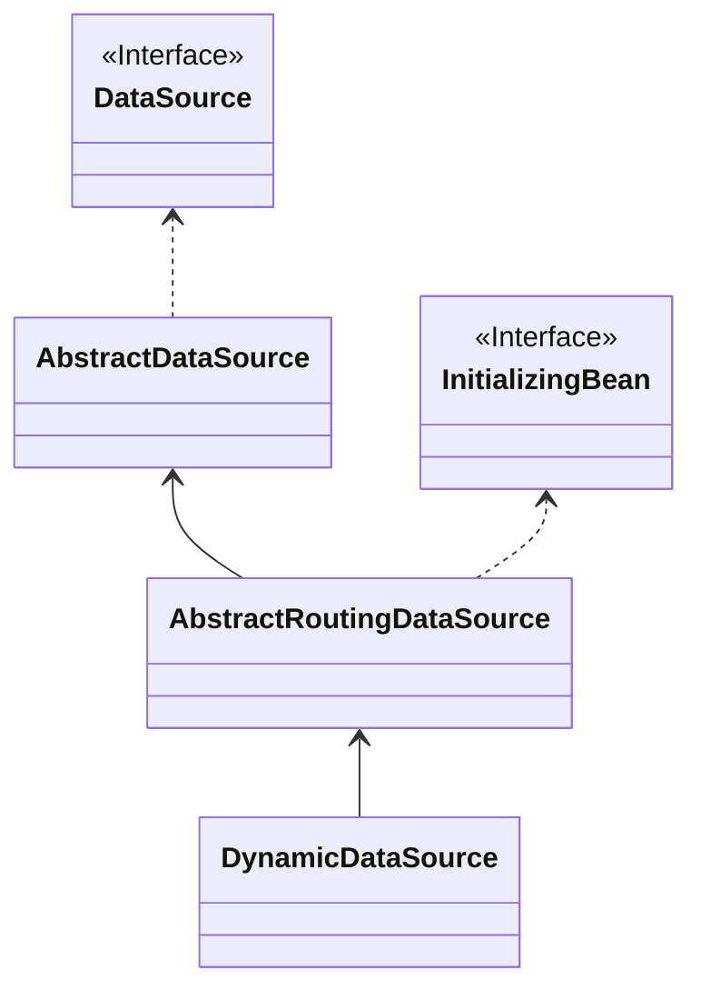

# 数据源切换失效分析

## 数据源切换原理

其实它的原理很简单，就是向Spring注入了多个数据源，然后当操作数据库的时候，再动态地去选择具体的数据源

而若依对此做了一次封装，它通过AOP切面去决定使用哪个数据源

下面简单说说数据源的抽象模型

### DataSource

这是一个接口，代表数据源，底层JDBC就是通过这个数据源来获取数据库连接的

```java
public interface DataSource  extends CommonDataSource, Wrapper {
  Connection getConnection() throws SQLException; //获取数据库连接
  Connection getConnection(String username, String password)
    throws SQLException;
}
```

而动态数据源跟它什么关系呢？



DynamicDataSource是若依自己定义的，它继承自AbstractRouintDataSource这个抽象类

下面简单说说这个抽象类（简略版）

### AbstractRoutingDataSource

```java
public abstract class AbstractRoutingDataSource {
	@Nullable
	private Map<Object, Object> targetDataSources;
	@Nullable
	private Object defaultTargetDataSource;
    @Nullable
	private Map<Object, DataSource> resolvedDataSources;
    //...
}
```

- targetDataSources：这里就代表你所定义的所有数据源，其中key可以为任意类型，是用来标识你的数据源，而value则一般是DataSource（至于这里为什么用Object，可能还是为了方便代码的处理吧）
- defaultTargetDataSource：默认的数据源
- resolvedDataSources：解析后的数据源，就是如果你定义的数据源没问题，那这里就等于resolvedDataSources

再来看看它是如何获取连接的

```java
@Override
public Connection getConnection() throws SQLException {
    return determineTargetDataSource().getConnection();
}
```

```java
protected DataSource determineTargetDataSource() {
    Assert.notNull(this.resolvedDataSources, "DataSource router not initialized");
    Object lookupKey = determineCurrentLookupKey(); //获取key
    DataSource dataSource = this.resolvedDataSources.get(lookupKey);
    if (dataSource == null && (this.lenientFallback || lookupKey == null)) {
        dataSource = this.resolvedDefaultDataSource;
    }
    return dataSource;
}
```

当调用动态数据源获取连接时，先通过`determineTargetDataSource`方法来决定使用哪个数据源，然后再通过这个数据源获取连接，所以**本质还是调用DataSource的getConnection**

### 总结

分析到这里，其实就很好理解了，如果我们想实现多数据源切换，那只要做两件事

- 向Spring注入多个数据源
- 定义好如何获取数据源的逻辑

## 准备工作

这里采用若依那一套来实现

### 建数据库和表

分别建了两个数据库，master和slave，然后在master库建了user表，在slave库建了role表，下面不再赘述

同时编写UserDO、RoleDO、UserMapper和RoleMapper，也忽略

### 注入多数据源

编写一个配置类DynamicConfig

```java
@Configuration
@EnableTransactionManagement
@EnableAspectJAutoProxy(exposeProxy = true)
@ComponentScan(value = "") //扫描Bean路径
@MapperScan("") //扫描Mapper接口路径
public class DynamicConfig {
    
	@Bean
	public PlatformTransactionManager transactionManager() {
		DataSourceTransactionManager transactionManager = new DataSourceTransactionManager();
		transactionManager.setDataSource(dataSource());
		transactionManager.setGlobalRollbackOnParticipationFailure(true);
		return transactionManager;
	}

	@Bean
	@Primary //注意不能少这个注解
	public DataSource dataSource() {
		Map<Object, Object> targetDataSources = new HashMap<>();
		targetDataSources.put(DataSourceType.MASTER.name(), master());
		targetDataSources.put(DataSourceType.SLAVE.name(), slave());
		return new DynamicDataSource(master(), targetDataSources);
	}

	@Bean
	public DataSource master() {
		DriverManagerDataSource dataSource = new DriverManagerDataSource();
		dataSource.setUrl("jdbc:mysql://127.0.0.1:3306/master?characterEncoding=utf-8&useSSL=false&serverTimezone=Asia/Shanghai");
		dataSource.setUsername("root");
		dataSource.setPassword("123456");
		return dataSource;
	}

	@Bean
	public DataSource slave() {
		DriverManagerDataSource dataSource = new DriverManagerDataSource();
		dataSource.setUrl("jdbc:mysql://127.0.0.1:3306/slave?characterEncoding=utf-8&useSSL=false&serverTimezone=Asia/Shanghai");
		dataSource.setUsername("root");
		dataSource.setPassword("123456");
		return dataSource;
	}
// --------------------- 下面是注入MyBatis -----------------------------------
	@Bean
	public SqlSessionFactory sqlSessionFactory() throws Exception {
		SqlSessionFactoryBean sessionFactoryBean = new SqlSessionFactoryBean();
		sessionFactoryBean.setDataSource(dataSource());
		// 设置Mapper.xml文件路径
		PathMatchingResourcePatternResolver resolver = new PathMatchingResourcePatternResolver();
		Resource[] resources = resolver.getResources("classpath*:/mapper/**/*.xml");
		sessionFactoryBean.setMapperLocations(resources);
		return sessionFactoryBean.getObject();
	}

	@Bean
	public SqlSessionTemplate sqlSession() throws Exception {
		return new SqlSessionTemplate(sqlSessionFactory());
	}
}
```

### 注解和枚举

由于使用切面，所以定义了注解

```java
@Target({ ElementType.METHOD, ElementType.TYPE })
@Retention(RetentionPolicy.RUNTIME)
@Documented
@Inherited
public @interface DataSource {
	DataSourceType value() default DataSourceType.MASTER;
}
```

```java
public enum DataSourceType {
	MASTER,
	SLAVE;
}
```

### DynamicDataSourceContextHolder

```java
public abstract class DynamicDataSourceContextHolder {
	private static final ThreadLocal<String> contextHolder = new ThreadLocal<>();

	public static void setDataSource(String dataSource) {
		DataSourceType ds = DataSourceType.valueOf(dataSource);
		contextHolder.set(ds.name());
	}

	public static String getDataSource() {
		return contextHolder.get();
	}

	public static void clearDataSource() {
		contextHolder.remove();
	}
}
```

这个是用来存放当前要使用的数据库的标识，跟下面的切面类相关

> 优化想法：应该用NamedInheritableThreadLocal来替代比较好，这样子线程也可以获取

### DynamicDataSource

```java
public class DynamicDataSource extends AbstractRoutingDataSource {

	public DynamicDataSource(DataSource deafultDataSource, Map<Object, Object> targetDataSources) {
		super.setDefaultTargetDataSource(deafultDataSource);
		super.setTargetDataSources(targetDataSources);
		super.afterPropertiesSet();
	}

	@Override
	protected Object determineCurrentLookupKey() {
		return DynamicDataSourceContextHolder.getDataSource();
	}
}
```

其实就是继承了一下，然后实现了决定使用哪个数据库的方法

### DynamicDataSourceAspect

```java
@Aspect
@Order(1)
@Component
public class DynamicDataSourceAspect {

	@Pointcut("@annotation(com.springframework.learn.dynamic.DataSource)"
			+ "|| @within(com.springframework.learn.dynamic.DataSource)")
	public void pointCut() {

	}

	@Around("pointCut()")
	public Object around(ProceedingJoinPoint point) throws Throwable {
		DataSource dataSource = getDataSource(point);
		if (dataSource != null) {
			DynamicDataSourceContextHolder.setDataSource(dataSource.value().name());
		}
		try {
			return point.proceed();
		} finally {
			DynamicDataSourceContextHolder.clearDataSource();
		}
	}
    
	public DataSource getDataSource(ProceedingJoinPoint point) {
		MethodSignature signature = (MethodSignature) point.getSignature();
		DataSource dataSource = AnnotationUtils.findAnnotation(signature.getMethod(), DataSource.class);
		if (Objects.nonNull(dataSource)) {
			return dataSource;
		}
		return AnnotationUtils.findAnnotation(signature.getDeclaringType(), DataSource.class);
	}
}
```

### 整体流程

1. 向Spring注入了三个DataSource的Bean，其中一个是DynamicDataSource，一个是Master对应的库，一个则是Slave对应的库
2. 向Spring注入MyBatis时，设置它的数据源从`dataSource()`方法获取
3. 当在某个方法中通过MyBatis去查询数据库，如果使用了`@DataSource`注解，就会进入切面，然后向`DynamicDataSourceContextHolder`设置你想操作的数据库标识
4. 而在MyBatis真正要执行SQL的时候，就会执行`determineTargetDataSource`方法，然后获取到对应的DataSource，去创建连接

## 失效案例分析

### 案例一 使用事务

先看场景：

```java
@Service
public class DynamicService {
	@Autowired
	private UserMapper userMapper; //主库
	@Autowired
	private RoleMapper roleMapper; //从库

	@Transactional
	public List<?> selectList() {
		return roleMapper.selectList(null);
	}
}
```

```java
@Mapper
@DataSource(value = DataSourceType.SLAVE)
public interface RoleMapper {
	List<RoleDO> selectList(@Param("roleIds") List<Long> roleIds);
}
```

执行后，会报找不到数据库的错误，说明切换数据源失效（如果不加事务注解是可以正常切换的）

分析：

- 切换数据源是通过AOP实现的
- 而Spring的事务也是通过AOP实现的，因此这就有一个顺序问题
- 要实现数据源切换，需要保证数据源的切换发生在事务开启之前

原理：

- Spring开启事务时，会先去新建一个连接，然后缓存到事务管理器中
- 当MyBatis去执行的时候，就会先从事务管理器中去获取连接，而不会再去创建连接
- 因此，如果数据源切换是在事务开启后才进行的，就会失效

源码：

开启事务代码位置：DataSourceTransactionManager#doBegin


> 中间忽略掉了跟这里无关的代码，重点关注第8行和第23行

bindResource方法


重点看第8行代码，这里会把DataSource作为key，ConnectionHolder作为value传入一个Map中，由于此时还没执行Mapper的切面方法，因此这里默认的连接就是和主库的连接

下面是断点的结果


而这个Map，就放在事务管理器中

```java
public abstract class TransactionSynchronizationManager {
	// key为DataSource对象，value为ConnectionHolder对象
	private static final ThreadLocal<Map<Object, Object>> resources =
			new NamedThreadLocal<>("Transactional resources");
    //...
}
```

那MyBatis是如何去获取这个连接的呢？首先要把目光拉回到配置类

```java
@Bean
public SqlSessionFactory sqlSessionFactory() throws Exception {
    SqlSessionFactoryBean sessionFactoryBean = new SqlSessionFactoryBean();
    sessionFactoryBean.setDataSource(dataSource());
    return sessionFactoryBean.getObject();
}
```

熟悉MyBatis的话，就会知道每当我们去操作数据库时，就会通过SqlSessionFactory去开启一个SqlSession来完成，而这里是通过SqlSessionFactoryBean来实现的，它是Spring的一个FactoryBean

这是它的`getObject()`方法

```java
@Override
public SqlSessionFactory getObject() throws Exception {
    if (this.sqlSessionFactory == null) {
      afterPropertiesSet();
    }
    return this.sqlSessionFactory;
}
```

由于它实现了InitializingBean接口，因此在这个Bean的初始化阶段，就会执行`afterPropertiesSet()`方法

```java
@Override
public void afterPropertiesSet() throws Exception {
	this.sqlSessionFactory = buildSqlSessionFactory();
}
```

再点进去`buildSqlSessionFactory()`方法，会发现这个方法很长，但只需要向下找到这行代码

```java
targetConfiguration.setEnvironment(new Environment(this.environment,
    this.transactionFactory == null ? new SpringManagedTransactionFactory() : this.transactionFactory,
    this.dataSource));
```

可以看到，Spring集成MyBatis后，会使用Spring的事务工厂来代替MyBatis原生的事务工厂

```java
public class SpringManagedTransactionFactory implements TransactionFactory {
    public SpringManagedTransactionFactory() {
    }
    //开启事务
    public Transaction newTransaction(DataSource dataSource, TransactionIsolationLevel level, boolean autoCommit) {
        return new SpringManagedTransaction(dataSource);
    }
}
```

> 可能你会纳闷，上面不是已经有开启事务了，为什么这里又需要一个事务工厂
>
> 实际上，上面开启的事务是Spring的事务机制，而这里开启的事务是MyBatis层面的（如果这句话很难理解，就先往下看）

我们进入`newTransacton()`这个方法，会新建一个SpringManagedTransaction对象

```java
public class SpringManagedTransaction implements Transaction {
    
  private final DataSource dataSource;
  private Connection connection;
  private boolean isConnectionTransactional;
  private boolean autoCommit;
    
  public SpringManagedTransaction(DataSource dataSource) {
    notNull(dataSource, "No DataSource specified");
    this.dataSource = dataSource;
  }

  //重点关注这个方法
  @Override
  public Connection getConnection() throws SQLException {
    if (this.connection == null) {
      openConnection();
    }
    return this.connection;
  }
    //...
}
```

我们再进入`getConnection()`这个方法

```java
  private void openConnection() throws SQLException {
    this.connection = DataSourceUtils.getConnection(this.dataSource); //重点看这里
    this.autoCommit = this.connection.getAutoCommit();
    this.isConnectionTransactional = DataSourceUtils.isConnectionTransactional(this.connection, this.dataSource);
  }
```

一直点进去，就会走到下面

```java
public static Connection doGetConnection(DataSource dataSource) throws SQLException {
    ConnectionHolder conHolder = (ConnectionHolder) TransactionSynchronizationManager.getResource(dataSource);
    //...
}
```

**从这里就可以看出来，MyBatis会尝试从事务管理器中获取数据库连接**

那这个`newTransaction()`是什么时候被调用的呢？

答案在MyBatis的源码中，位置：DefaultSqlSessionFactory#openSessionFromDataSource

```java
private SqlSession openSessionFromDataSource(ExecutorType execType, TransactionIsolationLevel level, boolean autoCommit) {
    Transaction tx = null;
    try {
      final Environment environment = configuration.getEnvironment();
      final TransactionFactory transactionFactory = getTransactionFactoryFromEnvironment(environment);
      tx = transactionFactory.newTransaction(environment.getDataSource(), level, autoCommit);
     //...
}
```

再来梳理一下：

1. Spring容器启动时，会构建一个SqlSessionFactory，而构建的过程中又会使用Spring的事务工厂代替MyBatis原生的事务工厂

2. 当我们执行查询时，由于使用了事务注解，因此Spring的事务机制会先建立一个数据库连接（默认是主库），然后缓存到事务管理器中

3. 这时候MyBatis才会开启一个SqlSession去查询，而查询又需要使用事务工厂去获取连接，而又由于这个事务工厂是Spring的事务工厂，因此会尝试从事务管理器中去获取连接，又因为在开启Spring事务的时候就已经创建连接了，因此这里能获取到
4. 而这里的连接是和主库的连接，因此SQL执行报错

**结论**

在使用事务的情况下，要想切换数据源能生效，就必须在Spring的事务开启前，先进行数据源的切换，这样Spring才会和你想要的数据库建立连接；因此，应该把切换数据源的注解放到DynamicService类上