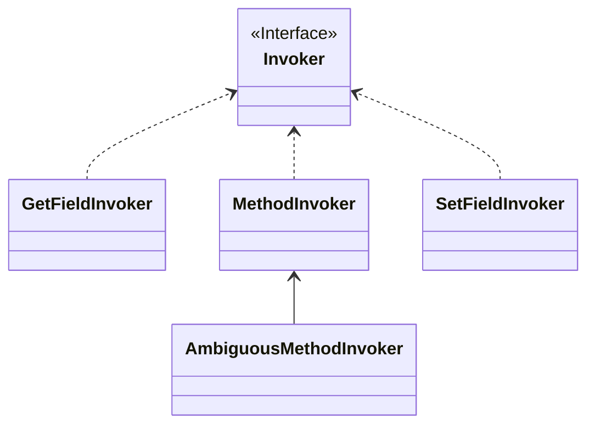

#Java #MyBatis 
这篇文档严格来说不算是MyBatis核心流程的功能，而是MyBatis框架中实现的一些工具类，但是先做一些了解有利于去读懂源码，而且其中的一些工具设计得也非常巧妙，值得去借鉴去学习
## 一、反射相关
```ad-tip
MyBatis中跟反射相关的API非常丰富，甚至比Spring中还多，而反射是框架中最常用的API，如果你也想写类似框架的组件，多学习反射相关API是很有意义的😄
```
### Reflector
该类其实可以算是一个用来**封账Class信息的容器**，为什么这么说，看看它的构造就知道了
```java fold title:Reflector
public class Reflector {

    private final Class<?> type;
    private final String[] readablePropertyNames;
    private final String[] writablePropertyNames;
    private final Map<String, Invoker> setMethods = new HashMap<>();
    private final Map<String, Invoker> getMethods = new HashMap<>();
    private final Map<String, Class<?>> setTypes = new HashMap<>();
    private final Map<String, Class<?>> getTypes = new HashMap<>();
    private Constructor<?> defaultConstructor;

```
下面是其中一些属性的介绍
* `readablePropertyNames / writeablePropertyNames`：存储可读/可写的属性的字段的名字，比如说如果一个Bean是有get方法，那么就认为是可读的，而如果是有set方法，则是认为可写的。因此，当MyBatis去获取/设置属性时，通过方法获取的优先级比直接通过属性高
* `setMethods() / getMethods()`：同样地，用来封装get和set方法
* `setTypes() / getTypes()`：同理
* `defaultConstructor`：默认的构造器

### Invoker
注意上面的`setMethods()`和`getMethods()` 中对应的value类型都是`Invoker` ，它其实是一个接口
```java fold title:Invoker
public interface Invoker {
    Object invoke(Object target, Object[] args) throws IllegalAccessException, InvocationTargetException;
    
    Class<?> getType();
}
```
其有以下的实现

那么它的作用很明显了，就是用来获取和设置对象的属性，因为并非所有对象都有`get` 方法和`set` 方法
**其实绕这么一大圈，MyBatis之所以要封装这些方法、类型，其实为了缓存，典型的用空间换时间**
```ad-tip
至于为什么MyBatis不能直接通过反射调`get`和`set`方法，我猜有以下两点原因
* 调用方法更符合规范，且不会导致权限失效
* 调用方法比直接设置属性效率更高？
```
### PropertyTokenizer
只看名字，确实很难理解这个类的作用，因为`Tokenizer`的意思是分词器，它的作用其实是为MyBatis**强大的映射配置**服务的
比如说，现在有这么个实体类：
```java
public class Model {
    private String id;
    private String name;
    private List<Entry> props;
    
    private static class Entry {
        private String key;
        private Object value;
    }
}
```
> 数据库中有两列，分别是key1和key2

而在MyBatis中，是支持这样配置映射关系的
```xml fold title:ModelMapper
<resultMap id=="model" class="test.Model">
    <id property="id" column="id" />
    <property name="name" column="name" />
    <property name="props[0].key" column="key1" />
    <property name="props[0].value" column="value1" />
    <property name="props[1].key" column="key2" />
    <property name="props[1].value" column="value2" />
</resultMap>
```
***
那么MyBatis中是如何处理的呢？
```java fold title:PropertyTokenizer
public class PropertyTokenizer implements Iterator<PropertyTokenizer> {
    private String name;
    private final String indexedName;
    private String index;
    private final String children;
	//...
}
```
**这个设计其实非常精妙，它实现了迭代器接口，同时这个迭代器里面也是它自己，很好地诠释了“可迭代”这个概念**
它的目的是什么呢？比如现在有一个表达式，`user[0].department.name` ，那么MyBaits就需要通过一个User对象，然后通过它的`deparment`属性获取第一个元素，再获取`name`属性，而`PropertyTokenizer`封装的就是这样一个**自迭代**的过程
***
再来看看它是如何实现的：
```java PropertyTokenizer
public class PropertyTokenizer implements Iterator<PropertyTokenizer> {
  private String name;
  private final String indexedName;
  private String index;
  private final String children;

  public PropertyTokenizer(String fullname) {
    int delim = fullname.indexOf('.');
    if (delim > -1) {
	  //表示有子对象，比如用来分割出user[0]和department.name
      name = fullname.substring(0, delim);
      children = fullname.substring(delim + 1);
    } else {
      name = fullname;
      children = null;
    }
    indexedName = name;
    delim = name.indexOf('[');
    if (delim > -1) {
	  //表示有子集合，比如用来分割出user[0]中的'0'和'user'
      index = name.substring(delim + 1, name.length() - 1);
      name = name.substring(0, delim);
    }
	//这里设置完后，当前元素的name就是user，index就是0，children就是department(第一次迭代)
  }

  @Override
  public boolean hasNext() {
    return children != null;
  }

  @Override
  public PropertyTokenizer next() {
    return new PropertyTokenizer(children);
  }
```
当对`PropertyTokenizer`迭代时，就可以级联获取它的属性，比如`user -> department -> name`，且如果这个元素是集合类型的话，它的index元素标识了它的下标
### MetaClasss
该类是用来封装类的元信息，其组合了`Reflector`和`PropertyTokenizer`来实现功能
#### findProperty
该方法用来级联判断一个Class中是否有指定的属性
```java fold title:findProperty
public String findProperty(String name, boolean useCamelCaseMapping) {
    if (useCamelCaseMapping) {
        // 如果使用了下划线转驼峰，则这个name要去掉下划线(但没有将下划线后的字母改为大写!)
        name = name.replace("_", "");
    }
    return findProperty(name);
}

public String findProperty(String name) {
    StringBuilder prop = buildProperty(name, new StringBuilder());
    return prop.length() > 0 ? prop.toString() : null;
}
```
如果能找到该属性，则返回，否则返回null
```java fold title:buildProperty
private StringBuilder buildProperty(String name, StringBuilder builder) {
    // 借助PropertyTokenizer解析
    PropertyTokenizer prop = new PropertyTokenizer(name);
    if (prop.hasNext()) {
        String propertyName = reflector.findPropertyName(prop.getName());
        if (propertyName != null) {
            builder.append(propertyName);
            builder.append(".");
            // 多级属性，再new一个MetaClass继续递归解析
            MetaClass metaProp = metaClassForProperty(propertyName);
            metaProp.buildProperty(prop.getChildren(), builder);
        }
    } else {
        // 单层属性，直接借助反射判断是否存在
        String propertyName = reflector.findPropertyName(name);
        if (propertyName != null) {
            builder.append(propertyName);
        }
    }
    return builder;
}
```
可以看到，它是通过刚才的分词器迭代来判断是否有指定属性
### ObjectWrapper
