#Java #MyBatis 
这篇文档严格来说不算是MyBatis核心流程的功能，而是MyBatis框架中实现的一些工具类，但是先做一些了解有利于去读懂源码，而且其中的一些工具设计得也非常巧妙，值得去借鉴去学习
## 一、反射相关
```ad-tip
MyBatis中跟反射相关的API非常丰富，甚至比Spring中还多，而反射是框架中最常用的API，如果你也想写类似框架的组件，多学习反射相关API是很有意义的😄
```
### Reflector
该类其实可以算是一个用来**封账Class信息的容器**，为什么这么说，看看它的构造就知道了
```java fold title:Reflector
public class Reflector {

    private final Class<?> type;
    private final String[] readablePropertyNames;
    private final String[] writablePropertyNames;
    private final Map<String, Invoker> setMethods = new HashMap<>();
    private final Map<String, Invoker> getMethods = new HashMap<>();
    private final Map<String, Class<?>> setTypes = new HashMap<>();
    private final Map<String, Class<?>> getTypes = new HashMap<>();
    private Constructor<?> defaultConstructor;

```
下面是其中一些属性的介绍
* `readablePropertyNames / writeablePropertyNames`：存储可读/可写的属性的字段的名字，比如说如果一个Bean是有get方法，那么就认为是可读的，而如果是有set方法，则是认为可写的。因此，当MyBatis去获取/设置属性时，通过方法获取的优先级比直接通过属性高
* `setMethods() / getMethods()`：同样地，用来封装get和set方法
* `setTypes() / getTypes()`：同理
* `defaultConstructor`：默认的构造器

### Invoker
注意上面的`setMethods()`和`getMethods()` 中对应的value类型都是`Invoker` ，它其实是一个接口
```java fold title:Invoker
public interface Invoker {
    Object invoke(Object target, Object[] args) throws IllegalAccessException, InvocationTargetException;
    
    Class<?> getType();
}
```
其有以下的实现

那么它的作用很明显了，就是用来获取和设置对象的属性，因为并非所有对象都有`get` 方法和`set` 方法
**其实绕这么一大圈，MyBatis之所以要封装这些方法、类型，其实为了缓存，典型的用空间换时间**
```ad-tip
至于为什么MyBatis不能直接通过反射调`get`和`set`方法，我猜有以下两点原因
* 调用方法更符合规范，且不会导致权限失效
* 调用方法比直接设置属性效率更高？
```
### PropertyTokenizer
只看名字，确实很难理解这个类的作用，因为`Tokenizer`的意思是分词器，它的作用其实是为MyBatis**强大的映射配置**服务的
比如说，现在有这么个实体类：
```java
public class Model {
    private String id;
    private String name;
    private List<Entry> props;
    
    private static class Entry {
        private String key;
        private Object value;
    }
}
```
> 数据库中有两列，分别是key1和key2

而在MyBatis中，是支持这样配置映射关系的
```xml fold title:ModelMapper
<resultMap id=="model" class="test.Model">
    <id property="id" column="id" />
    <property name="name" column="name" />
    <property name="props[0].key" column="key1" />
    <property name="props[0].value" column="value1" />
    <property name="props[1].key" column="key2" />
    <property name="props[1].value" column="value2" />
</resultMap>
```
***
那么MyBatis中是如何处理的呢？
```java fold title:PropertyTokenizer
public class PropertyTokenizer implements Iterator<PropertyTokenizer> {
    private String name;
    private final String indexedName;
    private String index;
    private final String children;
	//...
}
```
**这个设计其实非常精妙，它实现了迭代器接口，同时这个迭代器里面也是它自己，很好地诠释了“可迭代”这个概念**
它的目的是什么呢？比如现在有一个表达式，`user[0].department.name` ，那么MyBaits就需要通过一个User对象，然后通过它的`deparment`属性获取第一个元素，再获取`name`属性，而`PropertyTokenizer`封装的就是这样一个**自迭代**的过程
***
再来看看它是如何实现的：
```java PropertyTokenizer
public class PropertyTokenizer implements Iterator<PropertyTokenizer> {
  private String name;
  private final String indexedName;
  private String index;
  private final String children;

  public PropertyTokenizer(String fullname) {
    int delim = fullname.indexOf('.');
    if (delim > -1) {
	  //表示有子对象，比如用来分割出user[0]和department.name
      name = fullname.substring(0, delim);
      children = fullname.substring(delim + 1);
    } else {
      name = fullname;
      children = null;
    }
    indexedName = name;
    delim = name.indexOf('[');
    if (delim > -1) {
	  //表示有子集合，比如用来分割出user[0]中的'0'和'user'
      index = name.substring(delim + 1, name.length() - 1);
      name = name.substring(0, delim);
    }
	//这里设置完后，当前元素的name就是user，indexedName则是user[0]，index就是0，children就是department(第一次迭代)
  }

  @Override
  public boolean hasNext() {
    return children != null;
  }

  @Override
  public PropertyTokenizer next() {
    return new PropertyTokenizer(children);
  }
```
当对`PropertyTokenizer`迭代时，就可以级联获取它的属性，比如`user -> department -> name`，且如果这个元素是集合类型的话，它的index元素标识了它的下标
### MetaClasss
该类是用来封装类的元信息，其组合了`Reflector`和`PropertyTokenizer`来实现功能，从职责上来说，它主要是用来获取反射类型的信息，比如属性和方法
#### findProperty
该方法用来级联判断一个Class中是否有指定的属性
```java fold title:findProperty
public String findProperty(String name, boolean useCamelCaseMapping) {
    if (useCamelCaseMapping) {
        // 如果使用了下划线转驼峰，则这个name要去掉下划线(但没有将下划线后的字母改为大写!)
        name = name.replace("_", "");
    }
    return findProperty(name);
}

public String findProperty(String name) {
    StringBuilder prop = buildProperty(name, new StringBuilder());
    return prop.length() > 0 ? prop.toString() : null;
}
```
如果能找到该属性，则返回，否则返回null
```java fold title:buildProperty
private StringBuilder buildProperty(String name, StringBuilder builder) {
    // 借助PropertyTokenizer解析
    PropertyTokenizer prop = new PropertyTokenizer(name);
    if (prop.hasNext()) {
        String propertyName = reflector.findPropertyName(prop.getName());
        if (propertyName != null) {
            builder.append(propertyName);
            builder.append(".");
            // 多级属性，再new一个MetaClass继续递归解析
            MetaClass metaProp = metaClassForProperty(propertyName);
            metaProp.buildProperty(prop.getChildren(), builder);
        }
    } else {
        // 单层属性，直接借助反射判断是否存在
        String propertyName = reflector.findPropertyName(name);
        if (propertyName != null) {
            builder.append(propertyName);
        }
    }
    return builder;
}
```
可以看到，它是通过刚才的分词器迭代来判断是否有指定属性
### MetaObject
有MetaClass自然就有MetaObject，它代表的是对象的元信息，而从职责上来说，它主要也是用来获取和设置反射对象的值
```java fold title:MetaObject#MetaObject()
public class MetaObject {

  private final Object originalObject;
  private final ObjectWrapper objectWrapper;
  private final ObjectFactory objectFactory;
  private final ObjectWrapperFactory objectWrapperFactory;
  private final ReflectorFactory reflectorFactory;

  private MetaObject(Object object, ObjectFactory objectFactory, ObjectWrapperFactory objectWrapperFactory, ReflectorFactory reflectorFactory) {
    this.originalObject = object;
    this.objectFactory = objectFactory;
    this.objectWrapperFactory = objectWrapperFactory;
    this.reflectorFactory = reflectorFactory;

    if (object instanceof ObjectWrapper) {
      this.objectWrapper = (ObjectWrapper) object;
    } else if (objectWrapperFactory.hasWrapperFor(object)) {
      this.objectWrapper = objectWrapperFactory.getWrapperFor(this, object);
    } else if (object instanceof Map) {
      this.objectWrapper = new MapWrapper(this, (Map) object);
    } else if (object instanceof Collection) {
      this.objectWrapper = new CollectionWrapper(this, (Collection) object);
    } else {
      this.objectWrapper = new BeanWrapper(this, object);
    }
  }
```
> 关于这个ObjectWrapper，下面会提及
#### getValue
这个方法显然，是用来获取对象的属性值，且支持递归获取
```java fold title:MetaObject#getValue()
public Object getValue(String name) {
    // 借助PropertyTokenizer拆分属性
    PropertyTokenizer prop = new PropertyTokenizer(name);
    if (prop.hasNext()) {
        // MetaObject递归获取
        MetaObject metaValue = metaObjectForProperty(prop.getIndexedName());
        if (metaValue == SystemMetaObject.NULL_META_OBJECT) {
            return null;
        } else {
            return metaValue.getValue(prop.getChildren());
        }
    } else {
        // 单层级属性，直接调用ObjectWrapper
        return objectWrapper.get(prop);
    }
}
```

值得注意的是第6行代码，它使用的是`prop.getIndexedName()`，即带索引的属性值；这里依然使用`user[0].department.name`来举例：

### ObjectWrapper
这是一个接口，看名字就知道，它是针对对象做了一层包装，其中有以下核心方法：
```java fold title:ObjectWrapper
public interface ObjectWrapper {
    // 根据指定属性取值
    Object get(PropertyTokenizer prop);
    // 根据指定属性赋值
    void set(PropertyTokenizer prop, Object value);
    // 检查对象是否包含指定属性
    String findProperty(String name, boolean useCamelCaseMapping);
    // 检查对象是否包含指定属性的getter方法
    boolean hasSetter(String name);
    // 检查对象是否包含指定属性的setter方法
    boolean hasGetter(String name);
    // ......
}
```
>值得注意的是，上面的get()方法和set()方法传递的参数都是PropertyTokenizer

该接口有三个实现类

```mermaid fold title:ObjectWrapper继承关系
classDiagram
direction BT
class BaseWrapper
class BeanWrapper
class CollectionWrapper
class MapWrapper
class ObjectWrapper {
<<Interface>>

}

BaseWrapper  ..>  ObjectWrapper 
BeanWrapper  -->  BaseWrapper 
CollectionWrapper  ..>  ObjectWrapper 
MapWrapper  -->  BaseWrapper 

```

通过名字就可以看出，它们的区别是对不同的类型进行了包装，下面来看一个实现类
#### BeanWrapper

			