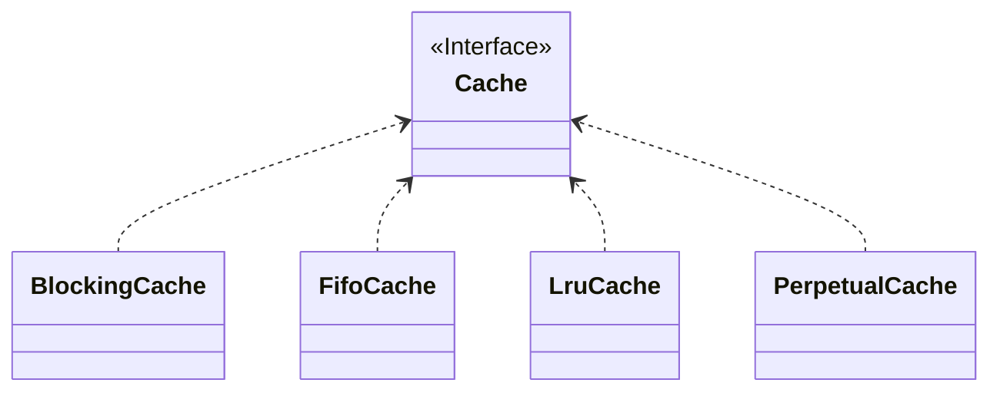

#Java #MyBatis/Cache
MyBatis设计了两层的缓存，分别是一级缓存和二级缓存，下面就来分别介绍它们的使用和原理
## 一级缓存
### 1、基本使用
#### 1.1 使用
* MyBatis中默认是开启一级缓存的，因此无需手动去获取
* 一级缓存是基于`sqlSession`的，因此如果连续查询同一条记录，MyBatis就会把这条记录放到一级缓存中，下一次查询就可以直接从数据库中获取；同样地，如果开启了新的`sqlSession`，那即使查询同一条记录，也无法使用到一级缓存
```ad-note 
一个sqlSession可以理解为一次对数据库的请求
```
#### 1.2 清空一级缓存
有以下几种清空一级缓存的方式（有些是主动，有些是被动）
* 在`xml`文件中使用查询语句时，把`flushCache`属性置为true
* 当使用DML语句时（即增删改），就会导致一级缓存被清空
* 使用`sqlSesseion#clearCache()`方法来手动清空

> 为什么使用DML语句会导致一级缓存被清空？很简单，因为当你使用DML语句时，往往意味着会修改数据库的记录，所以MyBatis索性把缓存清空掉，以免出现脏数据

#### 1.3 注意点
* 使用一级缓存固然可以提高查询的性能，但同时需要注意，因为MyBatis会将你查出来的数据放到一级缓存中，且存放的是对象的引用，因此如果你对这个对象进行了一定的”加工“，那么有可能导致你下一次获取到的缓存数据就非原始数据！

***
### 2、设计与原理
#### 2.1、Cache模型
```java fold title:Cache
public interface Cache {
    // 每个缓存都有id
    String getId();
    // 放缓存
    void putObject(Object key, Object value);
    // 取缓存
    Object getObject(Object key);
    // 删缓存
    Object removeObject(Object key);
    // 清缓存
    void clear();
    // 查大小
    int getSize();
}
```
Cache本身是一个接口，具体由它的子类来实现

这里没有展示全，其实Cache的实现类还有很多
虽然Cache的实现类很多，但其实只有一个最基本的实现类，那就是**PerpetualCache**，因为MyBatis采用的是**装饰者模式**来构造缓存机制，其他不同的实现类都是对它的增强
#### 2.2、装饰者模式
先来看看这个最基本的类：
```java fold title:PerpetualCache
public class PerpetualCache implements Cache {

  private final String id;
  private final Map<Object, Object> cache = new HashMap<>();

//...
}
```
是不是非常的朴实无华，只是用了一个HashMap来存放缓存的数据🐶
具体的其他功能，是由它的装饰者来实现的，比如我们想实现一个**先进先出的缓存策略**：
```java fold title:FifoCache
public class FifoCache implements Cache {

  private final Cache delegate;
  private final Deque<Object> keyList;
  private int size;

  public FifoCache(Cache delegate) {
    this.delegate = delegate;
    this.keyList = new LinkedList<>();
    this.size = 1024;
  }
//...
}
```
```ad-note
采用装饰者模式的最大好处就是，可以在不影响原有的功能情况下，随意的增添自己想要的功能；
至于缺点嘛，可能是会创建比较多的对象？
```
#### 2.3、何时生效
MyBatis是在`BaseExecutor#query()`方法执行时，先从一级缓存中看看是否有数据，如果命中则返回，否则再查询数据库
```java fold title:BaseExecutor#query
public <E> List<E> query(MappedStatement ms, Object parameter, RowBounds rowBounds, 
                         ResultHandler resultHandler, CacheKey key, BoundSql boundSql) throws SQLException {
    // ......
    // 如果statement指定了需要刷新缓存，则清空一级缓存
    if (queryStack == 0 && ms.isFlushCacheRequired()) {
        clearLocalCache();
    }
    List<E> list;
    try {
        queryStack++;
        // 查询之前先检查一级缓存中是否存在数据
        list = resultHandler == null ? (List<E>) localCache.getObject(key) : null;
        if (list != null) {
            // 有，则直接取缓存
            handleLocallyCachedOutputParameters(ms, key, parameter, boundSql);
        } else {
            // 没有，则查询数据库
            list = queryFromDatabase(ms, parameter, rowBounds, resultHandler, key, boundSql);
        }
    } finally {
        queryStack--;
    }
    if (queryStack == 0) {
        // ......
        // 全局localCacheScope设置为statement，则清空一级缓存
        if (configuration.getLocalCacheScope() == LocalCacheScope.STATEMENT) {
            // issue #482
            clearLocalCache();
        }
    }
    return list;
}
```
关于这个BaseExecutor是啥，后续生命周期章节再展开
## 二级缓存
实际开发中，二级缓存基本上不会用到，我们主要学习它的设计思想
### 1、基本使用
二级缓存是基于**namespace**的，即我们平时写xml文件时定义的命名空间，因此它是**跨sqlSession**的
要使用二级缓存一共有两种方式：
* 在`xml`文件中使用`<cache>`标签
* 在`Mapper`接口使用`@CacheNamespace`注解标注
另外，实体类一定要**实现Serializable接口**