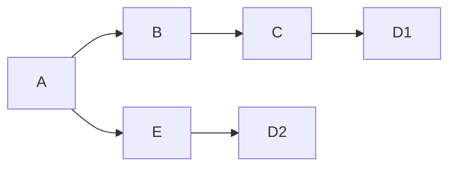
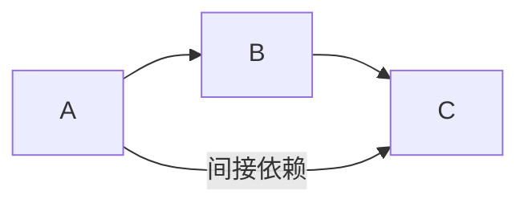
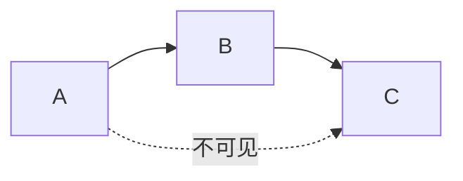
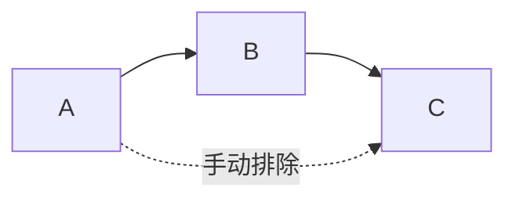
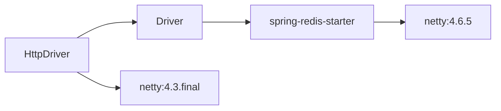

#Java #Maven

# Maven工具笔记

## 基本命令

1. **mvn clean**
   - **作用**: 删除 `target` 目录中的构建输出。
   - **示例**: `mvn clean`
   - **解释**: 清理项目，移除以前构建的所有文件。
2. **mvn compile**
   - **作用**: 编译源代码。
   - **示例**: `mvn compile`
   - **解释**: 编译项目的主源码。
3. **mvn test**
   - **作用**: 运行测试。
   - **示例**: `mvn test`
   - **解释**: 编译项目的测试代码并运行测试。
4. **mvn package**
   - **作用**: 打包编译好的代码成一个可分发的格式，比如 JAR 或 WAR 文件。
   - **示例**: `mvn package`
   - **解释**: 进行编译和测试，并将项目打包。
5. **mvn install**
   - **作用**: 将打包好的 JAR 文件安装到本地 Maven 仓库中，以便其他项目可以使用。
   - **示例**: `mvn install`
   - **解释**: 编译、测试、打包并安装到本地仓库。
6. **mvn deploy**
   - **作用**: 将最终的构建包复制到远程仓库中，以便共享给其他开发者或项目。
   - **示例**: `mvn deploy`
   - **解释**: 执行所有构建任务，并将构建输出上传到远程仓库。
7. **mvn validate**
   - **作用**: 验证项目是否正确且所有必要信息是否完整。
   - **示例**: `mvn validate`
   - **解释**: 检查项目的配置是否正确。
8. **mvn clean install**
   - **作用**: 清理项目并重新编译、测试和安装。
   - **示例**: `mvn clean install`
   - **解释**: 执行从清理到安装的一系列完整构建过程。
9. **mvn site**
   - **作用**: 生成项目的站点文档。
   - **示例**: `mvn site`
   - **解释**: 创建基于项目的信息的站点。
10. **mvn dependency:resolve**
    - **作用**: 解析项目的所有依赖项并下载。
    - **示例**: `mvn dependency:resolve`
    - **解释**: 下载项目的所有依赖库。
11. **mvn dependency:tree**
    - **作用**: 显示项目的依赖树。
    - **示例**: `mvn dependency:tree`
    - **解释**: 查看项目依赖的详细结构。
12. **mvn exec:java**
    - **作用**: 运行项目中的一个主类。
    - **示例**: `mvn exec:java -Dexec.mainClass="com.example.Main"`
    - **解释**: 运行指定的主类。

## Maven依赖的范围

在 Maven 项目中，依赖的范围（Scope）决定了依赖库在编译、测试、运行等不同阶段的可见性和使用方式。以下是 Maven 中常用的依赖范围：

1. **compile**

- **描述**: 默认范围，适用于编译、测试和运行时。
- **使用场景**: 任何时候都需要的依赖，如项目的核心库。
- **示例**: 
  ```xml
  <dependency>
    <groupId>org.example</groupId>
    <artifactId>example-lib</artifactId>
    <version>1.0.0</version>
    <scope>compile</scope>
  </dependency>
  ```

2. **provided**

- **描述**: 编译和测试时可用，但运行时不包含。通常由运行时环境或容器提供。
- **使用场景**: 例如，Servlet API，只有在编译和测试时需要，运行时由应用服务器提供。
- **示例**: 
  ```xml
  <dependency>
    <groupId>javax.servlet</groupId>
    <artifactId>javax.servlet-api</artifactId>
    <version>4.0.1</version>
    <scope>provided</scope>
  </dependency>
  ```

3. **runtime**

- **描述**: 编译时不需要，但在运行和测试时需要。
- **使用场景**: 例如，JDBC 驱动，编译时不需要，运行时才需要。
- **示例**: 
  ```xml
  <dependency>
    <groupId>mysql</groupId>
    <artifactId>mysql-connector-java</artifactId>
    <version>8.0.23</version>
    <scope>runtime</scope>
  </dependency>
  ```

4. **test**

- **描述**: 仅在测试编译和运行时可用，不在正常运行时使用。
- **使用场景**: 例如，JUnit 或 Mockito 等测试框架。
- **示例**: 
  ```xml
  <dependency>
    <groupId>junit</groupId>
    <artifactId>junit</artifactId>
    <version>4.13.2</version>
    <scope>test</scope>
  </dependency>
  ```

5. **system**

- **描述**: 与 `provided` 类似，但需要显式提供 JAR 文件路径。主要用于本地系统上的特定依赖。
- **使用场景**: 用于特殊情况的本地依赖，不常用。
- **示例**: 
  ```xml
  <dependency>
    <groupId>com.example</groupId>
    <artifactId>example-lib</artifactId>
    <version>1.0.0</version>
    <scope>system</scope>
    <systemPath>${project.basedir}/libs/example-lib-1.0.0.jar</systemPath>
  </dependency>
  ```

6. **import**

- **描述**: 仅用于 `dependencyManagement` 中，以导入依赖的 BOM（Bill of Materials）文件。
- **使用场景**: 用于导入依赖管理的 BOM 以统一依赖版本。
- **示例**: 
  
  ```xml
  <dependencyManagement>
    <dependencies>
      <dependency>
        <groupId>org.springframework.cloud</groupId>
        <artifactId>spring-cloud-dependencies</artifactId>
        <version>Hoxton.SR8</version>
        <type>pom</type>
        <scope>import</scope>
      </dependency>
    </dependencies>
  </dependencyManagement>
  ```

## 安装时跳过测试
使用命令：`mvn install -DskipTests` 

## 展示所有依赖

使用命令：`mvn dependency:tree`

如果在Linux下，还可以通过管道符进行筛选，如：`mvn dependency:tree | grep "io.netty"`

如果只想分析某个模块，可以这样：`mvn dependency:tree -Dincludes=groupId:artifactId`

## 依赖管理

### 依赖冲突

由于大型项目会有很多依赖，稍有不注意，就会产生依赖冲突，比如像这样：



由于依赖传递，A同时依赖了D1和D2，它们的版本不一致，就会导致所谓的**依赖冲突**问题

但是发生依赖冲突并不意味着就不能用，而是Maven会**根据优先级去选择其中一个版本执行**，假如恰好两个版本的API都是一致的，那么此时对程序而言可能并不会报错；但假如两个版本的API不一致，就有可能导致编译或运行报错

它有以下规则：

- **直接声明优先**：如果在pom文件中被直接声明，则版本会优先于依赖传递的版本
- **路径最短优先**：Maven会选择依赖树种路径最短的版本，如果两个版本的路径长度一致，则选择第一个声明的版本
  - Maven采用深度优先遍历的算法去计算路径，比如上面的D1的路径就是3，D2的路径就是2，因此会选择D2

### 可选依赖

假如依赖规则是这样的，在B中依赖了C，而A又依赖了B，此时由于依赖传递，A也会依赖到C



那如果我们不想让A依赖到C，可以这样做，**在B的pom文件中**，在对C的依赖加入`<optional>`标签

```xml
<dependency>
	<groupId>com.example</groupId>
    <artifactId>C</artifactId>
    <version>1.0.0</version>
    <optional>true</optional>
</dependency>
```

这样修改后，依赖规则就会变成这样：



此时，**A是不知道C的存在**

### 排除依赖

同样是刚才的需求，但是假如此时的C是一些框架，不可修改，那么就需要主动地从A中进行排除

可以使用`<exclusion>`标签进行排除

```xml
<dependency>
	<groupId>com.example</groupId>
    <artifactId>B</artifactId>
    <version>1.0.0</version>
    <exclusions>
		<exlusion>
            <groupId>com.example</groupId>
            <artifactId>C</artifactId>
            <version>1.0.0</version>
        </exlusion>
    </exclusions>
</dependency>
```

这样手动排除后，依赖规则就会变成这样：



此时，A知道C的存在，但手动排除掉

## 案例分析

### 案例一、依赖冲突

场景如下：父模块中进行了版本管理，子模块中既依赖了spring-redis-starter，又依赖了netty，而spring-redis-starter本身又依赖了netty，且它们的版本不一致，而两个版本的API恰好又有些不一致，这就导致了运行的时候出现了问题



**解决办法**

SpringBoot的依赖文件肯定是没办法修改的，因此只能修改自己的，而修改自己的最好办法就是排除

```xml
<dependency>
    <groupId>org.springframework.boot</groupId>
    <artifactId>spring-boot-starter-data-redis</artifactId>
    <exclusions>
        <exclusion>
            <groupId>io.netty</groupId>
            <artifactId>netty-all</artifactId>
        </exclusion>
    </exclusions>
</dependency>

<dependency>
    <groupId>io.netty</groupId>
    <artifactId>netty-all</artifactId>
</dependency>
```

### 案例二、NoClassDefFoundError

这种情况可能是由于你的代码中本身已经有对某个版本依赖的代码，而此时为了解决依赖冲突，你把这个版本排除掉，那么就会会找不到原有代码的一些依赖；因此要解决这个问题，要把依赖冲突版本的代码移除掉

